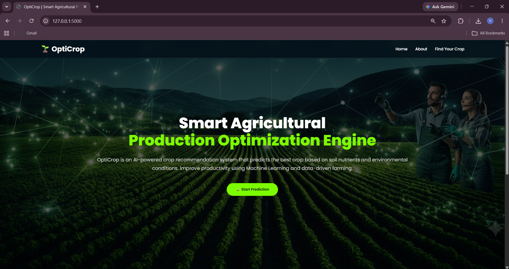
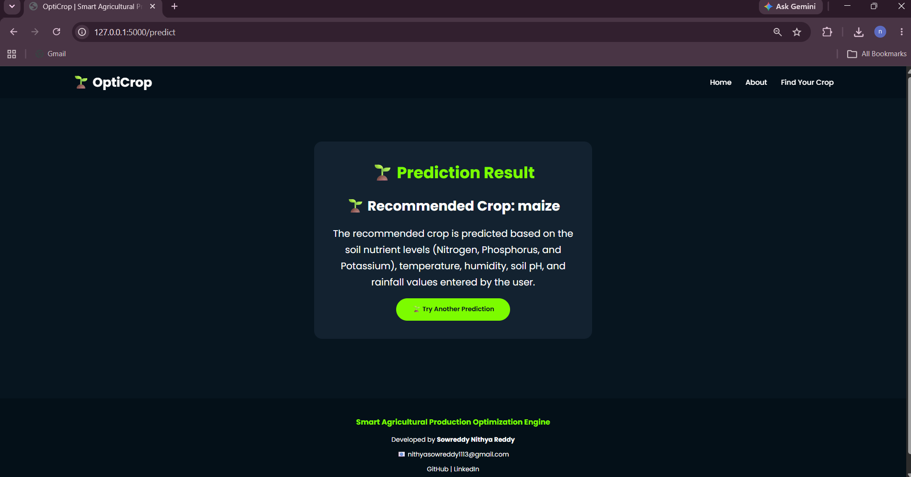

# 🌱 OptiCrop – AI-Powered Agricultural Recommendation System

## Smart Agricultural Production Optimization Engine

OptiCrop is a Machine Learning-based web application that recommends the most suitable crop for cultivation based on soil nutrients and environmental conditions. The system helps farmers make data-driven decisions to improve agricultural productivity and sustainability.

The application uses trained Machine Learning models to analyze soil and climate parameters and predict the best crop for cultivation.

---

# 🎯 Objectives

- Recommend suitable crops based on soil and environmental conditions.
- Improve agricultural productivity using Machine Learning.
- Assist farmers in making data-driven decisions.
- Promote sustainable farming practices.
- Demonstrate practical applications of AI in agriculture.

---

# 🚀 Features

- Crop recommendation using Machine Learning
- User-friendly web interface built with Flask
- Predicts crops based on:
  - Nitrogen (N)
  - Phosphorus (P)
  - Potassium (K)
  - Temperature
  - Humidity
  - Soil pH
  - Rainfall
- Input validation for secure predictions
- Responsive and attractive user interface
- Fast prediction using trained ML models
- Simple and easy-to-use application

---

# 🛠️ Technologies Used

## Programming Language
- Python 3

## Machine Learning
- Scikit-learn
- Pandas
- NumPy

## Web Framework
- Flask

## Frontend
- HTML5
- CSS3
- Bootstrap
- Jinja2 Templates

---

# 📂 Project Structure

```text
OptiCrop-AI-Powered-Agricultural-Recommendation-System
│
├── backend/
├── dataset/
├── documentation/
├── models/
│   └── model.pkl
│
├── notebooks/
├── screenshots/
├── static/
│
├── templates/
│   ├── index.html
│   ├── about.html
│   ├── predict.html
│   ├── result.html
│   ├── analytics.html
│   └── team.html
│
├── testing/
│
├── app.py
├── train_model.py
├── predict.py
├── utils.py
├── requirements.txt
├── README.md
└── .gitignore
```

---

# 📥 Input Parameters

| Parameter | Description |
|------------|-------------|
| Nitrogen (N) | Nitrogen level in soil |
| Phosphorus (P) | Phosphorus level in soil |
| Potassium (K) | Potassium level in soil |
| Temperature | Temperature (°C) |
| Humidity | Relative Humidity (%) |
| Soil pH | Soil acidity/alkalinity |
| Rainfall | Rainfall (mm) |

---

# 📤 Output

The system predicts and recommends the most suitable crop based on the provided soil and environmental conditions.

### Example

```text
Recommended Crop:
Maize
```

---

# 🤖 Machine Learning Workflow

1. Data Collection
2. Data Preprocessing
3. Exploratory Data Analysis
4. Model Training
5. Model Evaluation
6. Model Saving
7. Flask Web Integration
8. Crop Prediction

---

# ⚙️ Installation & Execution

## Clone Repository

```bash
git clone <repository-link>
```

## Navigate to Project Folder

```bash
cd OptiCrop-AI-Powered-Agricultural-Recommendation-System
```

## Install Required Packages

```bash
pip install -r requirements.txt
```

## Run Application

```bash
python app.py
```

## Open Browser

```text
http://127.0.0.1:5000/
```

---

# 📷 Project Screenshots

## 🏠 Home Page



## 🌱 Prediction Form


## ✅ Prediction Result



## ℹ️ About Page


---

# 🔮 Future Enhancements

- Fertilizer Recommendation System
- Crop Disease Detection using Deep Learning
- Weather API Integration
- Crop Yield Prediction
- Multi-language Support
- Mobile Application Development
- Real-Time Agricultural Dashboard
- Cloud Deployment

---

# 🎓 Internship Information

This project was developed as part of the APSCHE Artificial Intelligence & Machine Learning Virtual Internship Program.

---

# 👨‍💻 Team Members

- Sowreddy Nithya Reddy (Team Lead)
- Navya Sri Pavuluri
- Perugu Jagan Pooja
- Rishitha Pigili
- Pinjari Mansur

---

# 📌 Conclusion

OptiCrop combines Machine Learning and web technologies to provide an intelligent crop recommendation system. By analyzing soil nutrients and environmental conditions, the application assists farmers in selecting suitable crops, improving productivity, and promoting sustainable agriculture.

---

# 👩‍💻 Developed By

**Sowreddy Nithya Reddy and Team**

Smart Agricultural Production Optimization Engine (OptiCrop)

APSCHE AI & ML Virtual Internship Project

---

# ⭐ Support

If you found this project useful, consider giving this repository a ⭐ Star.

---

## 📄 License

This project is developed for educational and academic purposes.