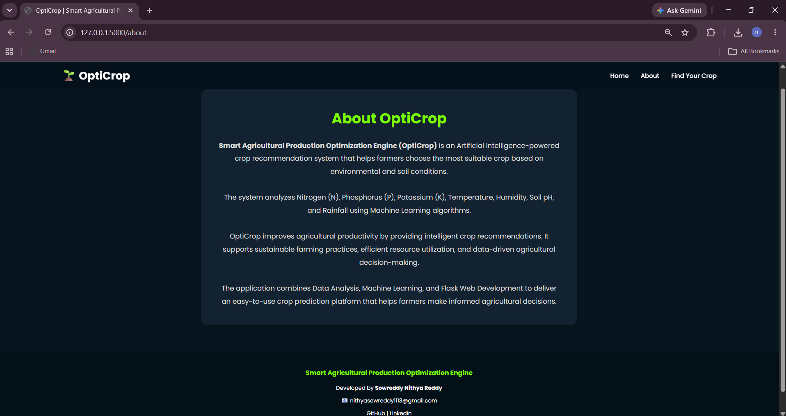

# 🌾 OptiCrop
## Smart Agricultural Production Optimization Engine

<p align="center">


</p>

---

## 📌 Project Overview

OptiCrop is an AI-powered agricultural recommendation system developed to assist farmers in selecting the most suitable crop based on soil nutrients and environmental conditions.

The system utilizes Machine Learning algorithms to analyze agricultural parameters and provide intelligent crop recommendations that help improve productivity, reduce resource wastage, and promote sustainable farming practices.

---

## 🎯 Problem Statement

Agriculture is highly dependent on soil quality and climatic conditions. Farmers often face difficulties in determining which crop is best suited for cultivation under varying environmental conditions.

OptiCrop addresses this challenge by applying Artificial Intelligence and Machine Learning techniques to recommend optimal crops using data-driven decision making.

---

# 🌱 Input Parameters

The system analyzes:

✅ Nitrogen (N)

✅ Phosphorous (P)

✅ Potassium (K)

✅ Temperature

✅ Humidity

✅ pH Value

✅ Rainfall

---

# 🚀 Key Features

- 🌾 AI-Based Crop Recommendation
- 🤖 Multiple Machine Learning Models
- 📊 Agricultural Data Analytics Dashboard
- 📈 Data Visualization
- 🌐 Interactive Flask Web Application
- 📱 Responsive User Interface
- ⚡ Real-Time Prediction System
- 🌍 Sustainable Farming Support

---

# 🧠 Machine Learning Models Used

- Logistic Regression
- Decision Tree Classifier
- Random Forest Classifier
- K-Nearest Neighbors (KNN)
- K-Means Clustering

Among these models, the best-performing model was selected and deployed.

---

# 🛠️ Technology Stack

## Programming Languages
- Python
- HTML5
- CSS3
- JavaScript

## Libraries
- Scikit-Learn
- Pandas
- NumPy
- Matplotlib
- Seaborn

## Frameworks
- Flask
- Bootstrap

## Tools
- VS Code
- Jupyter Notebook
- Git
- GitHub

---

# 📂 Project Structure

```text
OptiCrop-Smart-Agricultural-Production-Optimization-Engine
│
├── app.py
├── train_model.py
├── predict.py
├── utils.py
├── requirements.txt
│
├── dataset/
├── models/
├── notebooks/
├── templates/
├── static/
├── screenshots/
├── documentation/
└── README.md
```

---

# 📊 Machine Learning Workflow

1️⃣ Problem Understanding

2️⃣ Dataset Collection

3️⃣ Exploratory Data Analysis

4️⃣ Data Preprocessing

5️⃣ Model Building

6️⃣ Model Evaluation

7️⃣ Model Deployment

8️⃣ Crop Recommendation

---

# 📸 Application Screenshots

## 🏠 Home Page


---

## ℹ️ About Page



---

## 🌱 Prediction Form


---

## ✅ Prediction Result


---

# ⚙️ Installation

## Clone Repository

```bash
git clone https://github.com/nithyasowreddy/OptiCrop-Smart-Agricultural-Production-Optimization-Engine.git
```

## Install Requirements

```bash
pip install -r requirements.txt
```

## Run Application

```bash
python app.py
```

Application runs at:

```text
http://127.0.0.1:5000
```

---

# 🎥 Project Demonstration

## Demo Video

🔗 https://drive.google.com/file/d/16D96tPqICBeCJNGgZuPgQ4P_guz7yTa5/view

---

# 🌍 Future Enhancements

- Weather API Integration
- Fertilizer Recommendation System
- Disease Prediction System
- Mobile Application Development
- Multi-language Support
- Cloud Deployment

---

# 👩‍💻 Team Members

### Team Lead
👩‍💻 Sowreddy Nithya Reddy

### Team Members
- Navya Sri Pavuluri
- Perugu Jagan Pooja
- Rishitha Pigili
- Pinjari Mansur

---

# 🎓 APSCHE Internship Project

This project was developed as part of the:

**APSCHE Artificial Intelligence & Machine Learning Virtual Internship Program**

---

# 🔗 Repository Link

https://github.com/nithyasowreddy/OptiCrop-Smart-Agricultural-Production-Optimization-Engine

---

# ⭐ Support

If you found this project useful, please consider giving this repository a ⭐ on GitHub.

---

<p align="center">
Made with ❤️ for Smart Agriculture and Sustainable Farming
</p>
